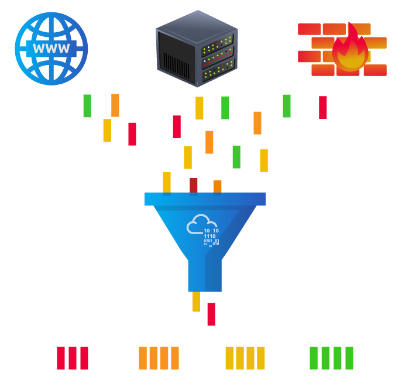
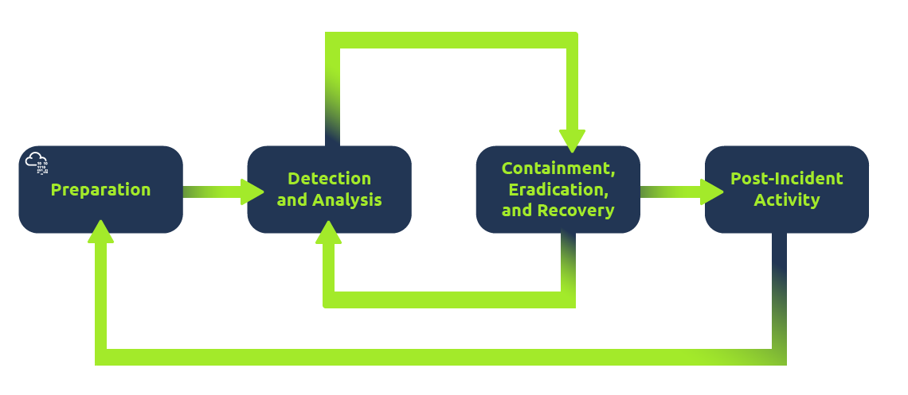
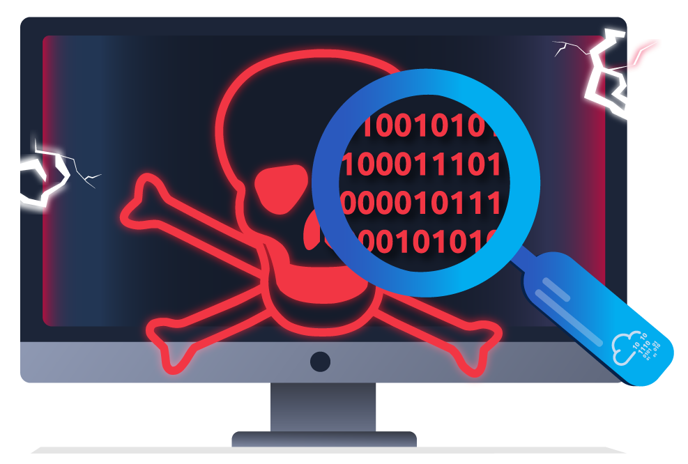
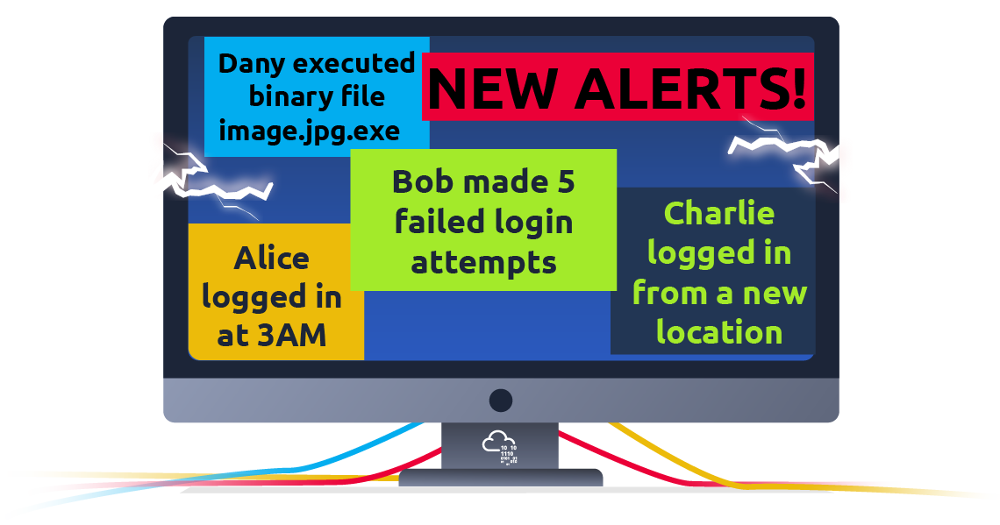

# Introducción a la seguridad defensiva

## <mark style="color:orange;">Introducción</mark>

En la sala anterior aprendimos [seguridad ofensiva](https://tryhackme.com/r/room/introtooffensivesecurity), cuyo objetivo es identificar y explotar las vulnerabilidades del sistema para mejorar las medidas de seguridad. Incluye la explotación de errores de software, el aprovechamiento de configuraciones inseguras y el aprovechamiento de políticas de control de acceso no aplicadas, entre otras estrategias. Los equipos rojos y los probadores de penetración se especializan en estas técnicas ofensivas.

En esta sala, examinaremos su contraparte, la **seguridad defensiva**. Se ocupa de dos tareas principales:

1. Evitar que se produzcan intrusiones
2. Detectar intrusiones cuando se producen y responder adecuadamente

Los equipos azules son parte del panorama de seguridad defensiva.

<figure><figcaption></figcaption></figure>

Algunas de las tareas relacionadas con la seguridad defensiva incluyen:

* **`Concienciación de los usuarios sobre ciberseguridad`**: Formar a los usuarios sobre ciberseguridad ayuda a protegerlos contra los ataques dirigidos a sus sistemas.
* **`Documentación y gestión de activos`**: Necesitamos conocer los sistemas y dispositivos que debemos gestionar y proteger adecuadamente.
* **`Actualización y aplicación de parches a los sistemas`**: Garantizar que los equipos, servidores y dispositivos de red estén correctamente actualizados y parcheados contra cualquier vulnerabilidad conocida (debilidad).
* **`Configuración de dispositivos de seguridad preventiva`**: el firewall y los sistemas de prevención de intrusiones (IPS) son componentes críticos de la seguridad preventiva. Los firewalls controlan qué tráfico de red puede entrar y qué puede salir del sistema o la red. IPS bloquea cualquier tráfico de red que coincida con las reglas actuales y las firmas de ataque.
* **`Configuración de dispositivos de registro y monitoreo`**: El registro y el monitoreo adecuados de la red son esenciales para detectar actividades maliciosas e intrusiones. Si aparece un nuevo dispositivo no autorizado en nuestra red, deberíamos ser capaces de detectarlo.

La seguridad defensiva es mucho más. Aparte de lo anterior, también cubriremos los siguientes temas relacionados:

* Centro de Operaciones de Seguridad (SOC)
* Inteligencia de amenazas
* Análisis forense digital y respuesta a incidentes (DFIR))
* Análisis de malware

#### _<mark style="color:purple;">Responda las siguientes preguntas</mark>_

1. ¿Qué equipo se enfoca en la seguridad defensiva?  **`Blue Team`**

## <mark style="color:orange;">Áreas de seguridad defensiva</mark>

En esta tarea, trataremos dos temas principales relacionados con la seguridad defensiva:

* Centro de Operaciones de Seguridad (SOC), donde cubrimos la Inteligencia de Amenazas
* Análisis forense digital y respuesta a incidentes (DFIR), donde también cubrimos el análisis de malware

### <mark style="color:yellow;">Centro de operaciones de seguridad (SOC)</mark>

Un _Centro de Operaciones de Seguridad (SOC)_ es un equipo de profesionales de la ciberseguridad que supervisa la red y sus sistemas para detectar eventos maliciosos de ciberseguridad. Algunas de las principales áreas de interés para un SOC son:

* **`Vulnerabilidades:`** Siempre que se descubre una vulnerabilidad (debilidad) del sistema, es esencial solucionarla instalando una actualización o parche adecuado. Cuando una solución no está disponible, se deben tomar las medidas necesarias para evitar que un atacante la aproveche. Aunque la remediación de vulnerabilidades es vital para un SOC, no necesariamente se les asigna.
* **`Violaciones de políticas:`** Una política de seguridad es un conjunto de reglas necesarias para proteger la red y los sistemas. Por ejemplo, podría ser una infracción de política si los usuarios cargan datos confidenciales de la empresa en un servicio de almacenamiento en línea.
* **`Actividad no autorizada:`** considere el caso en el que se roban el nombre de inicio de sesión y la contraseña de un usuario y el atacante los utiliza para iniciar sesión en la red. Un SOC debe detectar y bloquear un evento de este tipo lo antes posible antes de que se produzcan más daños.
* **`Intrusiones en la red:`** Por muy buena que sea su seguridad, siempre existe la posibilidad de que se produzca una intrusión. Una intrusión puede ocurrir cuando un usuario hace clic en un enlace malicioso o cuando un atacante explota un servidor público. En cualquier caso, cuando se produce una intrusión, debemos detectarla lo antes posible para evitar daños mayores.

Las operaciones de seguridad abarcan diversas tareas para garantizar la protección; Una de esas tareas es la inteligencia de amenazas.

<figure><figcaption></figcaption></figure>

### <mark style="color:yellow;">**Inteligencia de amenazas**</mark>

_La inteligencia_ se refiere a la información que recopilas sobre los enemigos reales y potenciales. Una _amenaza_ es cualquier acción que pueda interrumpir o afectar negativamente a un sistema.

La inteligencia de amenazas recopila información para ayudar a la empresa a prepararse mejor contra posibles adversarios. El propósito sería lograr una _defensa informada sobre amenazas_.&#x20;

Diferentes empresas tienen diferentes adversarios. Algunos adversarios pueden tratar de robar los datos de los clientes de un operador de telefonía móvil; Sin embargo, otros adversarios están interesados en detener la producción en una refinería de petróleo.&#x20;

Algunos ejemplos de adversarios son un ejército cibernético de un Estado-nación que trabaja por razones políticas y un grupo de ransomware que actúa con fines financieros. En función de la empresa (objetivo), podemos esperar adversarios.

<figure><figcaption></figcaption></figure>

La inteligencia necesita datos. Los datos deben recopilarse, procesarse y analizarse. Los datos se recopilan de fuentes locales, como registros de red, y de fuentes públicas, como foros. El procesamiento de datos los organiza en un formato adecuado para el análisis. La fase de análisis busca encontrar más información sobre los atacantes y sus motivos; Además, tiene como objetivo crear una lista de recomendaciones y pasos a seguir.

Aprender sobre tus adversarios te permite conocer sus tácticas, técnicas y procedimientos. Como resultado de la inteligencia de amenazas, identificamos al actor de amenazas (adversario) y predecimos su actividad. En consecuencia, podemos mitigar sus ataques y preparar una estrategia de respuesta.

### <mark style="color:yellow;">Análisis forense digital y respuesta a incidentes (DFIR)</mark>

Esta sección trata sobre el análisis forense digital y la respuesta a incidentes (DFIR), y cubriremos:

* Análisis forense digital
* Respuesta a incidentes
* Análisis de malware

#### <mark style="color:yellow;">**Análisis forense digital**</mark>

La medicina forense es la aplicación de la ciencia para investigar delitos y establecer hechos. Con el uso y la difusión de los sistemas digitales, como las computadoras y los teléfonos inteligentes, nació una nueva rama de la medicina forense para investigar delitos relacionados: la informática forense, que más tarde evolucionó hacia la _informática forense digital_.

En la seguridad defensiva, el enfoque de la ciencia forense digital se desplaza al análisis de las pruebas de un ataque y sus autores y otras áreas como el robo de propiedad intelectual, el ciberespionaje y la posesión de contenido no autorizado. En consecuencia, el análisis forense digital se centrará en diferentes áreas, tales como:

* **`Sistema de archivos:`** El análisis de una imagen forense digital (copia de bajo nivel) del almacenamiento de un sistema revela mucha información, como programas instalados, archivos creados, archivos parcialmente sobrescritos y archivos eliminados.
* **`Memoria del sistema:`** si el atacante ejecuta su programa malicioso en la memoria sin guardarlo en el disco, tomar una imagen forense (copia de bajo nivel) de la memoria del sistema es la mejor manera de analizar su contenido y aprender sobre el ataque.
* **`Registros del sistema:`** cada equipo cliente y servidor mantiene diferentes archivos de registro sobre lo que está sucediendo. Los archivos de registro proporcionan mucha información sobre lo que sucedió en un sistema. Incluso si el atacante intenta borrar sus rastros, algunos rastros permanecerán.
* **`Registros de red:`** Los registros de los paquetes de red que han atravesado una red ayudarían a responder más preguntas sobre si se está produciendo un ataque y qué implica.

#### <mark style="color:yellow;">**Respuesta incidente**</mark>

Un _incidente_ se refiere a una violación de datos o ataque cibernético; Sin embargo, en algunos casos, puede ser algo menos crítico, como una configuración incorrecta, un intento de intrusión o una infracción de la política.&#x20;

Ejemplos de un ataque cibernético incluyen un atacante que hace que nuestra red o sistemas sean inaccesibles, desfigurando (cambiando) el sitio web público y una violación de datos (robando datos de la empresa).&#x20;

¿Cómo _respondería_ a un ataque cibernético? La respuesta a incidentes especifica la metodología que se debe seguir para manejar un caso de este tipo. El objetivo es reducir el daño y recuperarse en el menor tiempo posible. Lo ideal sería desarrollar un plan que esté listo para la respuesta a incidentes.

Las cuatro fases principales del proceso de respuesta a incidentes son:

1. **`Preparación:`** Esto requiere un equipo capacitado y listo para manejar incidentes. Lo ideal es que se pongan en marcha varias medidas para evitar que ocurran incidentes en primer lugar.
2. **`Detección y Análisis:`** El equipo cuenta con los recursos necesarios para detectar cualquier incidencia; Además, es fundamental analizar más a fondo cualquier incidente detectado para conocer su gravedad.
3. **`Contención, erradicación y recuperación:`** Una vez que se detecta un incidente, es crucial evitar que afecte a otros sistemas, eliminarlo y recuperar los sistemas afectados. Por ejemplo, cuando notamos que un sistema está infectado con un virus informático, nos gustaría detener (contener) que el virus se propague a otros sistemas, limpiar (erradicar) el virus y garantizar una recuperación adecuada del sistema.
4. **`Actividad posterior al incidente:`** después de una recuperación exitosa, se genera un informe y se comparte la lección aprendida para evitar incidentes futuros similares.

<figure><figcaption></figcaption></figure>

### <mark style="color:yellow;">**Análisis de malware**</mark>

_Malware (software malicioso)_. El software se refiere a programas, documentos y archivos que puede guardar en un disco o enviar a través de la red. El malware incluye muchos tipos, como:

* Un **`virus`** es un fragmento de código (parte de un programa) que se adhiere a un programa. Está diseñado para propagarse de una computadora a otra y funciona alterando, sobrescribiendo y eliminando archivos una vez que infecta una computadora. El resultado va desde que la computadora se vuelve lenta hasta inutilizable.
* **`Caballo de troya`** es un programa que muestra una función deseable pero esconde una función maliciosa debajo. Por ejemplo, una víctima puede descargar un reproductor de video de un sitio web sospechoso que le da al atacante un control total sobre su sistema.
* El **`ransomware`** es un programa malicioso que encripta los archivos del usuario. El cifrado hace que los archivos sean ilegibles sin conocer la contraseña de cifrado. El atacante ofrece al usuario la contraseña de cifrado si el usuario está dispuesto a pagar un "rescate".

<figure><figcaption></figcaption></figure>

El análisis de malware tiene como objetivo conocer este tipo de programas maliciosos utilizando varios medios:

1. El análisis estático funciona inspeccionando el programa malicioso sin ejecutarlo. Por lo general, esto requiere un sólido conocimiento del lenguaje ensamblador (el conjunto de instrucciones del procesador, es decir, las instrucciones fundamentales de la computadora).
2. El análisis dinámico funciona ejecutando el malware en un entorno controlado y supervisando sus actividades. Le permite observar cómo se comporta el malware cuando se ejecuta.

#### _<mark style="color:purple;">Responda las siguientes preguntas</mark>_

1. ¿Cómo llamaría a un equipo de profesionales de la seguridad cibernética que monitorea una red y sus sistemas en busca de eventos maliciosos? **`Security Operations Center`**
2. ¿Qué significa DFIR? **`Digital Forensics and Incident Response`**
3. ¿Qué tipo de malware requiere que el usuario pague dinero para recuperar el acceso a sus archivos? **`ransomware`**

## <mark style="color:orange;">Ejemplo práctico de seguridad defensiva</mark>

Supongamos que usted es un analista del _Centro de Operaciones de Seguridad_ (SOC) responsable de proteger un banco. El SOC de este banco utiliza una herramienta _de gestión de eventos e información de seguridad_ (SIEM), que recopila información y eventos relacionados con la seguridad de varias fuentes y los presenta en un solo panel. Si el SIEM encuentra algo sospechoso, se generará una alerta.

<figure><figcaption></figcaption></figure>

Sin embargo, no todas las alertas son maliciosas. Depende del analista utilizar su experiencia en ciberseguridad para investigar cuáles son perjudiciales.

Por ejemplo, puede encontrar una alerta en la que un usuario ha fallado varios intentos de inicio de sesión. Si bien es sospechoso, este tipo de cosas suceden, especialmente si el usuario ha olvidado su contraseña y continúa intentando iniciar sesión.

Además, puede haber alertas relacionadas con conexiones desde direcciones IP desconocidas. Una dirección IP es como la dirección de su computadora en Internet: le dice a otras computadoras dónde enviar la información que solicita. Cuando estas direcciones son desconocidas, podría significar que alguien nuevo está intentando conectarse o que alguien está intentando acceder no autorizado.

### <mark style="color:yellow;">Simulación de un SIEM</mark>

Hemos preparado una simulación simplificada e interactiva de un sistema SIEM para brindarle una experiencia práctica similar a la que encuentran los analistas de seguridad cibernética.

Para comenzar esta simulación, haga clic en el botón "**Ver sitio**" a continuación.

Esta acción abrirá un "sitio estático" en el lado derecho de la pantalla. Siga las instrucciones paso a paso proporcionadas en la simulación para navegar por los eventos y localizar la "marca". Una bandera es una serie de caracteres con un formato como este: **`THM{RANDOM_WORDS}`**. Use esta bandera para responder preguntas de las salas aquí en TryHackMe, como la que se muestra a continuación.

#### <mark style="color:yellow;">¿Qué sigue?</mark>

En esta sala, hemos discutido los diferentes subcampos (SOC, Inteligencia de amenazas, Análisis de malware y DFIR) y hemos experimentado de primera mano cómo lidiar con las alertas en un entorno SIEM simulado. Si bien hemos cubierto mucho, la profundidad y complejidad de este campo significa que hay más que aprender y explorar.

Las lecciones aprendidas aquí le servirán de base a medida que las amenazas cibernéticas evolucionen, exigiendo aprendizaje, vigilancia y adaptación continuos.\

Continúe aprendiendo visitando la siguiente sala de esta serie, "Habilidades de búsqueda". Esta sala le enseñará técnicas valiosas para buscar información en línea para ayudar en sus investigaciones y aprendizaje.

\
Si desea adelantarse y obtener más información sobre los temas tratados en esta sala, se recomiendan las siguientes salas:

* [Introducción a SIEM](https://tryhackme.com/r/room/introtosiem) - Una introducción a la información de seguridad y la gestión de eventos
* [Operaciones de seguridad](https://tryhackme.com/r/room/securityoperations): obtenga información sobre el Centro de operaciones de seguridad (SOC): sus responsabilidades, servicios y fuentes de datos
* [DFIR : Una introducción](https://tryhackme.com/r/room/introductoryroomdfirmodule) - Sala introductoria para el módulo DFIR
* [Introducción al análisis de malware](https://tryhackme.com/r/room/intromalwareanalysis): qué hacer cuando se encuentra con un presunto malware

#### _<mark style="color:purple;">Responda las siguientes preguntas</mark>_

1. ¿Cuál es la bandera que obtuviste al seguirlo? **`THM{THREAT-BLOCKED}`**
