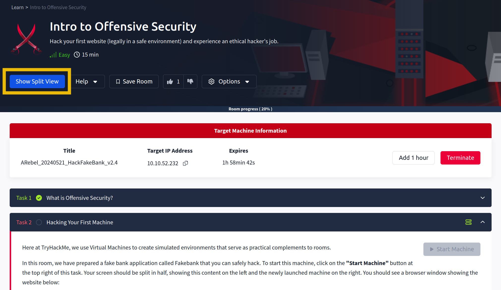
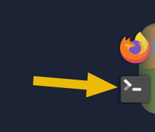
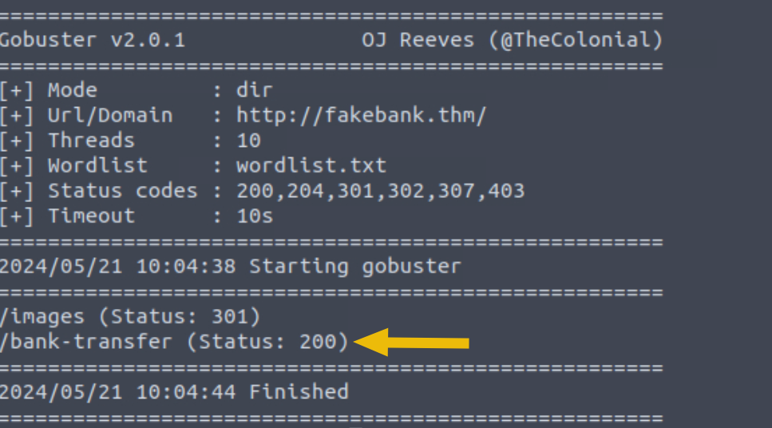
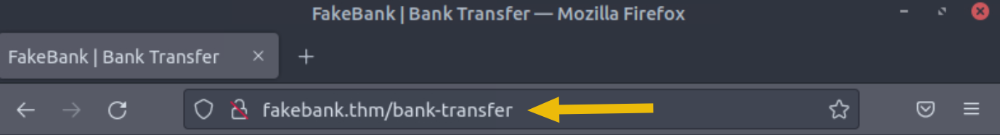

# Introducción a la seguridad ofensiva

## <mark style="color:orange;">¿Qué es la seguridad ofensiva?</mark>

<div align="center"><figure><figcaption></figcaption></figure></div>

"Para ser más astuto que un hacker, hay que pensar como uno".

Este es el núcleo de la "Seguridad Ofensiva". Implica irrumpir en los sistemas informáticos, explotar errores de software y encontrar lagunas en las aplicaciones para obtener acceso no autorizado. El objetivo es comprender las tácticas de los hackers y mejorar las defensas de nuestro sistema.

### <mark style="color:yellow;">Comenzando tu viaje de aprendizaje</mark>

En esta sala de TryHackMe, se le guiará a través de la piratería de su primer sitio web en un entorno legal y seguro. El objetivo es mostrarte cómo opera un hacker ético.

Pero antes de hacer eso, repasemos respondiendo las preguntas a continuación. Escriba su respuesta en el cuadro de texto después de la pregunta y haga clic en el botón "Enviar". Cuando haya terminado, continúe con la Tarea 2.

#### _<mark style="color:purple;">Responda las siguientes preguntas</mark>_

1. ¿Cuál de las siguientes opciones representa mejor el proceso en el que se simulan las acciones de un hacker para encontrar vulnerabilidades en un sistema? **`Offensive Security`**

## <mark style="color:orange;">Hackeando tu primera máquina</mark>

Aquí en TryHackMe, utilizamos Máquinas Virtuales para crear entornos simulados que sirven como complementos prácticos a las salas.

En esta sala, hemos preparado una aplicación bancaria falsa llamada _Fakebank_ que puedes hackear de forma segura. Para iniciar esta máquina, haga clic en el botón **`Iniciar máquina`** a continuación.

Su pantalla debe dividirse por la mitad, mostrando este contenido a la izquierda y la máquina recién iniciada a la derecha. Si lo ocultas más tarde, siempre puedes hacer clic en el botón **`Mostrar vista dividida`** en la parte superior para volver a mostrarlo. Debería ver una ventana del navegador que muestra el sitio web a continuación:

<figure><figcaption></figcaption></figure>

Si no ve el que se muestra arriba, use el botón **`Mostrar vista dividida`** en la parte superior de esta página.

<figure><figcaption></figcaption></figure>

### <mark style="color:yellow;">Tu primer truco</mark>

Usaremos una aplicación de línea de comandos llamada "[Gobuster](https://github.com/OJ/gobuster)" para forzar el sitio web de FakeBank para encontrar directorios y páginas ocultas. Gobuster tomará una lista de posibles nombres de páginas o directorios e intentará acceder a un sitio web con cada uno de ellos; Si la página existe, te lo dice.

#### <mark style="color:green;">Paso 1. Abrir una terminal</mark>

Un terminal, también conocido como línea de comandos, nos permite interactuar con un ordenador sin necesidad de utilizar una interfaz gráfica de usuario. En la máquina, abra el terminal haciendo clic en el icono de Terminal a la derecha de la pantalla.

<figure><figcaption></figcaption></figure>

#### <mark style="color:green;">Paso 2. Use Gobuster para encontrar páginas ocultas del sitio web</mark>

La mayoría de las empresas tienen una página de portal de administración, que brinda a su personal acceso a controles administrativos básicos para las operaciones diarias. En el caso de un banco, es posible que un empleado necesite transferir dinero desde y hacia las cuentas de los clientes. Debido a errores humanos o negligencias, puede haber casos en los que estas páginas no se conviertan en privadas, lo que permite a los atacantes encontrar páginas ocultas que muestran o dan acceso a controles de administración o datos confidenciales.

Para comenzar, escriba el siguiente comando en el terminal para encontrar páginas potencialmente ocultas en el sitio web de FakeBank usando Gobuster (una aplicación de seguridad de línea de comandos).

```
gobuster -u http://fakebank.thm -w wordlist.txt dir
```

El comando se ejecutará y le mostrará una salida similar a esta:

<div align="center" data-full-width="false"><figure><figcaption></figcaption></figure></div>

En el comando anterior, se usa **`-u`** para indicar el sitio web que estamos escaneando, **`-w`** toma una lista de palabras para iterar y encontrar páginas ocultas.\


Verá que Gobuster escanea el sitio web con cada palabra de la lista, encontrando páginas que existen en el sitio. Gobuster le habrá indicado las páginas en la lista de nombres de páginas/directorios (indicados por Estado: 200).

<figure><figcaption></figcaption></figure>

#### <mark style="color:green;">Paso 3. Hackear el banco</mark>

Deberías haber encontrado una página secreta de transferencia bancaria que te permite transferir dinero entre cuentas bancarias **`(/bank-transfer)`**. Escriba la página oculta en el sitio web de FakeBank usando la barra de direcciones del navegador.

<figure><figcaption></figcaption></figure>

Desde esta página, un atacante tiene acceso autorizado y puede robar dinero de cualquier cuenta bancaria. Como hacker ético, encontraría (con permiso) vulnerabilidades en su aplicación y las denunciaría al banco para solucionarlas antes de que un hacker las explote.

Su misión es transferir $ 2000 de la cuenta bancaria 2276 a su cuenta (número de cuenta 8881). Si su transferencia se realizó correctamente, ahora debería poder ver su nuevo saldo reflejado en la página de su cuenta.

¡Ve allí ahora y confirma que tienes el dinero! (Es posible que deba presionar Actualizar para que aparezcan los cambios)

#### _<mark style="color:purple;">Responda las siguientes preguntas</mark>_

1. Sobre el saldo de su cuenta, ahora debería ver un mensaje que indica la respuesta a esta pregunta. ¿Puedes encontrar la respuesta que necesitas? **`BANK-HACKED`**
2. Si fueras un probador de penetración o un consultor de seguridad, este es un ejercicio que realizarías para que las empresas prueben las vulnerabilidades de sus aplicaciones web y encuentren páginas ocultas para investigar las vulnerabilidades.
3. Termine la máquina haciendo clic en el botón rojo "Terminar" en la parte superior de la página.

## <mark style="color:orange;">Carreras en ciberseguridad</mark>

La gente a menudo se pregunta cómo otros se convierten en hackers (_consultores de seguridad_) o defensores (_analistas de seguridad que luchan cibercrimen_), y la respuesta es sencilla. Desglose, aprenda un área de la seguridad cibernética que le interese y practique regularmente el uso de ejercicios manuales.&#x20;

Crea el hábito de aprender un poco cada día en TryHackMe, y Adquirirás los conocimientos necesarios para conseguir tu primer trabajo en el sector.

Confía en nosotros; ¡Tú puedes hacerlo! Basta con echar un vistazo a algunas personas que han utilizado TryHackMe para conseguir su primer trabajo de seguridad:

* Paul pasó de ser un trabajador de la construcción a un ingeniero de seguridad. [Leer más](https://tryhackme.com/r/resources/blog/construction-worker-to-security-engineer-how-paul-used-tryhackme-to-land-his-first-job-in-security)
* Kassandra pasó de ser profesora de música a ser una profesional de la seguridad. [Leer más](https://tryhackme.com/r/resources/blog/the-teacher-becomes-the-student)
* Brandon usó TryHackMe mientras estaba en la escuela para conseguir su primer trabajo en cibernética. [Leer más](https://tryhackme.com/r/resources/blog/brandons-success-story)

### <mark style="color:yellow;">¿Qué carreras hay?</mark>

La sala de carreras cibernéticas profundiza en las diferentes carreras en cibernética. Sin embargo, aquí hay un breve Descripción de algunos roles de seguridad ofensiva:

* **`Probador de penetración:`** Responsable de probar productos tecnológicos para encontrar vulnerabilidades de seguridad explotables.
* **`Red Teamer`**: desempeña el papel de un adversario, atacando a una organización y proporcionando retroalimentación de un perspectiva del enemigo.
* **`Ingeniero de seguridad:`** diseñe, supervise y mantenga controles de seguridad, redes y sistemas para ayudar a prevenir Ataques cibernéticos.

#### _<mark style="color:purple;">Responda las siguientes preguntas</mark>_

1. ¡Lee lo anterior y continúa con la siguiente habitación!
