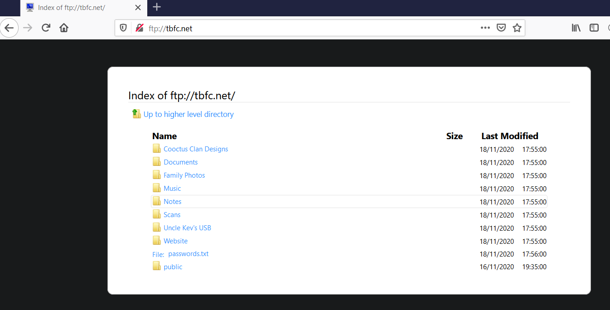

# Modelo OSI



## <mark style="color:orange;">¿Qué es el modelo OSI?</mark>

<figure><figcaption></figcaption></figure>

El modelo OSI (o Open Systems Interconnection Model) es un modelo absolutamente fundamental utilizado en redes. Este modelo crítico proporciona un marco que dicta cómo todos los dispositivos en red enviarán, recibirán e interpretarán los datos.

Uno de los principales beneficios del modelo OSI es que los dispositivos pueden tener diferentes funciones y diseños en una red mientras se comunican con otros dispositivos. Los datos enviados a través de una red que sigue la uniformidad del modelo OSI pueden ser entendidos por otros dispositivos.

El modelo OSI consta de siete capas que se ilustran en el diagrama a continuación. Cada capa tiene un conjunto diferente de responsabilidades y se organiza desde la Capa 7 hasta la Capa 1.

En cada capa individual por la que viajan los datos, se llevan a cabo procesos específicos y se agregan piezas de información a estos datos, que es lo que discutiremos en las próximas tareas dentro de esta sala. Sin embargo, por ahora, solo necesitamos entender que este proceso se llama encapsulación y cómo se ve el modelo OSI en el siguiente diagrama:

<figure><figcaption></figcaption></figure>

#### _<mark style="color:purple;">Responda las siguientes preguntas</mark>_

1. ¿Qué significa "OSI" en "Modelo OSI"?  **`Open Systems Interconnection`**
2. ¿Cuántas capas (en dígitos) tiene el modelo OSI? **`7`**
3. ¿Cuál es el término clave para cuando se agregan piezas de información a los datos? **`encapsulation`**

## <mark style="color:orange;">Capa 1 - Físico</mark>

<figure><figcaption></figcaption></figure>

Esta capa es una de las más fáciles de agarrar. En pocas palabras, esta capa hace referencia a los componentes físicos del hardware utilizado en las redes y es la capa más baja que encontrará. Los dispositivos utilizan señales eléctricas para transferir datos entre sí en un sistema de numeración binario (1 y 0).

Por ejemplo, los cables Ethernet que conectan dispositivos, como en la imagen a continuación:

<figure><figcaption></figcaption></figure>

#### _<mark style="color:purple;">Responda las siguientes preguntas</mark>_

1. ¿Cómo se llama esta capa? **`Physical`**
2. ¿Cómo se llama el sistema de numeración que es tanto 0 como 1? **`Binary`**
3. ¿Cómo se llaman los cables que se utilizan para conectar los dispositivos? **`Ethernet Cables`**

## <mark style="color:orange;">Capa 2 - Enlace de datos</mark>

La capa de enlace de datos se centra en el direccionamiento físico de la transmisión. Recibe un paquete de la capa de red (incluida la dirección IP del equipo remoto) y agrega la dirección **MAC** física (Media Access Control) del punto final receptor. Dentro de cada computadora habilitada para la red hay una tarjeta **de**interfaz **de red (NIC**) que viene con una dirección MAC única para identificarla.

Las direcciones MAC son establecidas por el fabricante y literalmente grabadas en la tarjeta; No se pueden cambiar, aunque se pueden falsificar. Cuando la información se envía a través de una red, en realidad es la dirección física la que se utiliza para identificar dónde exactamente enviar la información.

Además, también es trabajo de la capa de enlace de datos presentar los datos en un formato adecuado para la transmisión.

#### _<mark style="color:purple;">Responda las siguientes preguntas</mark>_

1. ¿Cómo se llama esta capa? **`Data Link`**
2. ¿Cómo se llama la pieza de hardware con la que vienen todos los dispositivos en red?  **`Network Interface Card`**

## <mark style="color:orange;">Capa 3 - Red</mark>

La tercera capa del modelo OSI (capa de red) es donde tiene lugar la magia del enrutamiento y el reensamblaje de datos (desde estos pequeños fragmentos hasta el trozo más grande). En primer lugar, el enrutamiento simplemente determina la ruta más óptima a la que se deben enviar estos fragmentos de datos.

Si bien algunos protocolos en esta capa determinan exactamente cuál es la ruta "óptima" que deben tomar los datos para llegar a un dispositivo, solo deberíamos saber sobre su existencia en esta etapa del módulo de red. En resumen, estos protocolos incluyen OSPF (Open Shortest Path Ffirst) y RIP (Routing Information Protocol). Los factores que deciden qué ruta se toma se deciden por lo siguiente:

* ¿Cuál es el camino más corto? Es decir, tiene la menor cantidad de dispositivos por los que el paquete necesita viajar.
* ¿Qué camino es el más fiable? Es decir, ¿se han perdido paquetes en esa ruta antes?
* ¿Qué ruta tiene la conexión física más rápida? Es decir, ¿hay un camino que utiliza una conexión de cobre (más lenta) o una fibra (considerablemente más rápida)?

En esta capa, todo se trata a través de direcciones IP como 192.168.1.100. Los dispositivos como los routers capaces de entregar paquetes mediante direcciones IP se conocen como dispositivos de capa 3, porque son capaces de trabajar en la tercera capa del modelo OSI.

<figure><figcaption></figcaption></figure>

#### _<mark style="color:purple;">Responda las siguientes preguntas</mark>_

1. ¿Cómo se llama esta capa?  **`Network`**
2. ¿Los paquetes tomarán la ruta más óptima a través de una red? (S/N)  **`Y`**
3. ¿Qué significa el acrónimo "OSPF"?  **`Open Shortest Path First`**
4. ¿Qué significa el acrónimo "RIP"?  **`Routing Information Protocol`**
5. ¿Qué tipo de direcciones se tratan en esta capa?  **`IP Addresses`**

## <mark style="color:orange;">Capa 4 - Transporte</mark>

La capa 4 del modelo OSI desempeña un papel vital en la transmisión de datos a través de una red y puede ser un poco difícil de entender. Cuando los datos se envían entre dispositivos, se sigue uno de dos protocolos diferentes que se deciden en función de varios factores:

* TCP
* UDP

Comencemos con TCP. La Transmission Control Protocol (TCP). Potencialmente insinuado por el nombre, este protocolo está diseñado teniendo en cuenta la fiabilidad y la garantía. Este protocolo reserva una conexión constante entre los dos dispositivos durante la cantidad de tiempo que tardan los datos en enviarse y recibirse.

No solo esto, sino que TCP incorpora la comprobación de errores en su diseño. La comprobación de errores es la forma en que TCP puede garantizar que los datos enviados desde los fragmentos pequeños de la capa de sesión (capa 5) se hayan recibido y vuelto a ensamblar en el mismo orden.

Vamos a resumir las ventajas y desventajas de TCP en la siguiente tabla:

| 
Ventajas de TCP 
                                                                   | 
Desventajas de TCP 
                                                                                                                                          |
| -------------------------------------------------------------------------------------------- | ---------------------------------------------------------------------------------------------------------------------------------------------------------------------- |
| 
Garantiza la exactitud de los datos. 
                                              | 
Requiere una conexión confiable entre los dos dispositivos. Si no se recibe un pequeño fragmento de datos, no se puede utilizar todo el fragmento de datos. 
 |
| 
Capaz de sincronizar dos dispositivos para evitar que el otro se inunde de datos. 
 | 
Una conexión lenta puede generar un cuello de botella en otro dispositivo, ya que la conexión estará reservada en la computadora receptora todo el tiempo. 
  |
| 
Realiza muchos más procesos para mayor confiabilidad. 
                             | TCP es significativamente más lento que UDP porque los dispositivos que utilizan este protocolo deben realizar más trabajo.                                            |

TCP se utiliza para situaciones como el intercambio de archivos, la navegación por Internet o el envío de un correo electrónico. Este uso se debe a que estos servicios requieren que los datos sean precisos y completos (¡no sirve de nada tener la mitad de un archivo!).

En el siguiente diagrama, podemos ver cómo una imagen de un gato se descompone en pequeños fragmentos de datos (conocidos como paquetes) desde el "servidor web", donde la "computadora" reconstruye la imagen del gato en el orden correcto.

<figure><figcaption></figcaption></figure>

Ahora pasemos al User Datagrama Protocol (o UDP para abreviar). Este protocolo no es tan avanzado como su hermano, el protocolo TCP. No cuenta con las muchas características que ofrece TCP, como la verificación de errores y la confiabilidad. De hecho, cualquier dato que se envía a través de UDP se envía a la computadora, ya sea que llegue allí o no. No hay sincronización entre los dos dispositivos ni garantía; Solo espero lo mejor y cruzamos los dedos.

Si bien esto suena desventajoso, tiene sus méritos, que describiremos en la siguiente tabla:

| Ventajas de UDP                                                                                                                                        | Desventajas de UDP                                                                                 |
| ------------------------------------------------------------------------------------------------------------------------------------------------------ | -------------------------------------------------------------------------------------------------- |
| 
UDP es mucho más rápido que TCP. 
                                                                                                            | 
A UDP no le importa si se reciben los datos. 
                                            |
| 
UDP deja que la capa de la aplicación (software de usuario) decida si hay algún control sobre la rapidez con la que se envían los paquetes. 
 | 
Es bastante flexible para los desarrolladores de software en este sentido. 
              |
| 
UDP no reserva una conexión continua en un dispositivo como lo hace TCP. 
                                                                    | Esto significa que las conexiones inestables resultan en una experiencia terrible para el usuario. |

Usando el mismo ejemplo que antes, ahora podemos ver que solo los paquetes #1 y #3 han sido recibidos por la "Computadora", lo que significa que falta la mitad de la imagen.

<figure><figcaption></figcaption></figure>

UDP es útil en situaciones en las que se envían pequeños fragmentos de datos. Por ejemplo, los protocolos utilizados para descubrir dispositivos (_ARP_ y _DHCP_ que discutimos en [la Sala 2 - Introducción a LAN)](https://tryhackme.com/room/introtolan) o archivos más grandes como la transmisión de video (donde está bien si alguna parte del video está pixelada. ¡Los píxeles son solo fragmentos de datos perdidos!)

#### _<mark style="color:purple;">Responda las siguientes preguntas</mark>_

1. ¿Cómo se llama esta capa?  **`Transport`**
2. ¿Qué significa TCP?  **`Transmission Control Protocol`**
3. ¿Qué significa UDP?  **`User Datagram Protocol`**
4. ¿Qué protocolo garantiza la exactitud de los datos?  **`TCP`**
5. ¿A qué protocolo no le importa si los datos son recibidos o no por el otro dispositivo?  **`UDP`**
6. ¿Qué protocolo utilizaría una aplicación como un cliente de correo electrónico?  **`TCP`**
7. ¿Qué protocolo utilizaría una aplicación que descarga archivos?  **`TCP`**
8. ¿Qué protocolo utilizaría una aplicación que transmite vídeo?  **`UDP`**

## <mark style="color:orange;">Capa 5 - Sesión</mark>

<figure><figcaption></figcaption></figure>

Una vez que los datos se han traducido o formateado correctamente desde la capa de presentación (capa 6), la capa de sesión (capa 5) comenzará a crear y mantener la conexión con otro equipo al que se destinen los datos. Cuando se establece una conexión, se crea una sesión. Mientras esta conexión está activa, también lo está la sesión.

La capa de sesión también se encarga de cerrar la conexión si no se ha utilizado durante un tiempo o si se pierde. Además, una sesión _puede_ contener "puntos de control", en los que, si se pierden los datos, solo se requiere que se envíen los datos más recientes, lo que ahorra ancho de banda.

Lo que vale la pena señalar es que las sesiones son únicas, lo que significa que los datos no pueden viajar a través de diferentes sesiones, sino de hecho, solo a través de cada sesión.

#### _<mark style="color:purple;">Responda las siguientes preguntas</mark>_

1. ¿Cómo se llama esta capa?  **`Session`**
2. ¿Cuál es el término técnico para cuando una conexión se establece con éxito?  **`Session`**

## <mark style="color:orange;">Capa 6 - Presentación</mark>

La capa 6 del modelo OSI es la capa en la que comienza a tener lugar la estandarización. Debido a que los desarrolladores de software pueden desarrollar cualquier software, como un cliente de correo electrónico, de manera diferente, los datos aún deben manejarse de la misma manera, sin importar cómo funcione el software.

Esta capa actúa como traductor de datos hacia y desde la capa de aplicación (capa 7). El ordenador receptor también entenderá los datos enviados a un ordenador en un formato destinado a otro formato. Por ejemplo, cuando envía un correo electrónico, es posible que el otro usuario tenga otro cliente de correo electrónico para usted, pero el contenido del correo electrónico aún deberá mostrarse igual.

Las características de seguridad, como el cifrado de datos (como HTTPS cuando se visita un sitio seguro) se producen en esta capa.

#### _<mark style="color:purple;">Responda las siguientes preguntas</mark>_

1. ¿Cómo se llama esta capa?  **`Presentation`**
2. ¿Cuál es el objetivo principal de esta capa?  **`Translator`**

## <mark style="color:orange;">Capa 7 - Aplicación</mark>

La capa de aplicación del modelo OSI es la capa con la que estará más familiarizado. Esta familiaridad se debe a que la capa de aplicación es la capa en la que se implementan protocolos y reglas para determinar cómo debe interactuar el usuario con los datos enviados o recibidos.

Las aplicaciones cotidianas, comolos clientes de correo electrónico, los navegadores o el software de navegación del servidor de archivos, como FileZilla, proporcionan una interfazgráfica de usuario (GUI) amigable y gráfica para que los usuarios interactúen con los datos enviados o recibidos. Otros protocolos incluyen DNS (Domain Name System), que es la forma en que las direcciones de los sitios web se traducen en direcciones IP.

<figure><figcaption></figcaption></figure>

#### _<mark style="color:purple;">Responda las siguientes preguntas</mark>_

1. ¿Cómo se llama esta capa?  **`Application`**
2. ¿Cuál es el término técnico que se le da al nombre del software con el que interactúan los usuarios?  **`Graphical User Interface`**

## <mark style="color:orange;">Práctico - Juego OSI</mark>

¿Puedes escapar de la mazmorra OSI? ¡Sube los niveles en el orden correcto para escapar de la mazmorra y revelar la bandera! (¿Puedes superar la puntuación más alta de nuestro personal de 19 segundos?)\

Haga clic en el botón "Ver sitio" a la derecha para comenzar.

#### _<mark style="color:purple;">Responda las siguientes preguntas</mark>_

1. Escapa de la mazmorra para recuperar la bandera. ¿Qué es la bandera?  **`THM{OSI_DUNGEON_ESCAPED}`**

## <mark style="color:orange;">Continúe su aprendizaje: paquetes y tramas</mark>

Continúa tu aprendizaje uniéndote a la [sala "Paquetes y Marcos".](https://tryhackme.com/room/packetsframes)

#### _<mark style="color:purple;">Responda las siguientes preguntas</mark>_

1. Únase a la [sala "Paquetes y tramas".](https://tryhackme.com/room/packetsframes)
