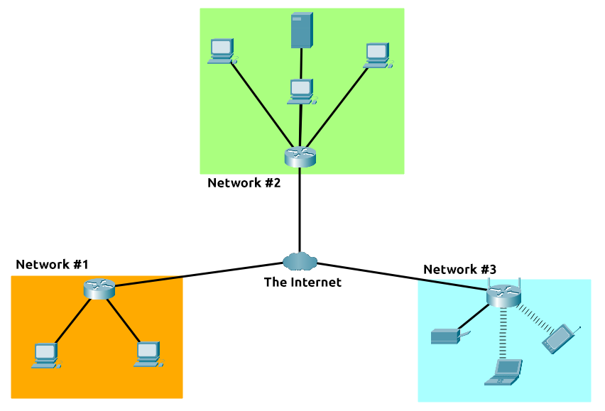
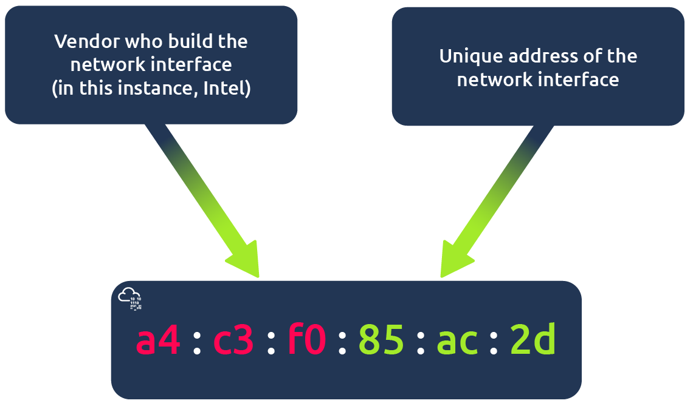
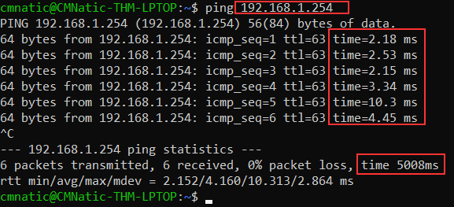

# ¿Qué es el networking?


¿Qué es el networking?


Las redes son simplemente cosas conectadas. Por ejemplo, su círculo de amistades: todos están conectados debido a intereses, pasatiempos, habilidades y tipos similares.

Las redes se pueden encontrar en todos los ámbitos de la vida:

* El sistema de transporte público de una ciudad
* Infraestructuras como la red eléctrica nacional para la electricidad
* Conocer y saludar a los vecinos
* Sistemas postales para el envío de cartas y paquetes

Pero más específicamente, en informática, las redes son la misma idea, solo que dispersa a los dispositivos tecnológicos. Tomemos como ejemplo tu teléfono; La razón por la que lo tienes es para acceder a las cosas. Cubriremos cómo estos dispositivos se comunican entre sí y las reglas que siguen.

En informática, una red puede estar formada por desde 2 dispositivos hasta miles de millones. Estos dispositivos incluyen todo, desde su computadora portátil y teléfono hasta cámaras de seguridad, semáforos e incluso agricultura.

Las redes están integradas en nuestra vida cotidiana. Ya sea recopilando datos sobre el clima, entregando electricidad a los hogares o incluso determinando quién tiene el derecho de paso en una carretera. Debido a que las redes están tan integradas en la actualidad, las redes son un concepto esencial para comprender en la ciberseguridad.

Tome el siguiente diagrama como ejemplo, ¡Alice, Bob y Jim han formado su red! Hablaremos de esto un poco más adelante.

<figure><figcaption></figcaption></figure>

Las redes vienen en todas las formas y tamaños, que es algo que también discutiremos a lo largo de este módulo.

#### _<mark style="color:purple;">Responda las siguientes preguntas</mark>_

1. ¿Cuál es el término clave para los dispositivos que están conectados entre sí? **`Network`**

## <mark style="color:orange;">¿Qué es Internet?</mark>

Ahora que hemos aprendido qué es una red y cómo se define en informática (solo dispositivos conectados), exploremos Internet.

Internet es una red gigante que consta de muchas, muchas redes pequeñas dentro de sí misma. Usando nuestro ejemplo de la tarea anterior, imaginemos ahora que Alice hizo unos nuevos amigos llamados Zayn y Toby a los que quiere presentar a Bob y Jim. El problema es que Alice es la única persona que habla el mismo idioma que Zayn y Toby. ¡Así que Alicia tendrá que ser la mensajera!

<figure><figcaption></figcaption></figure>

Debido a que Alice puede hablar ambos idiomas, pueden comunicarse entre sí a través de Alice, formando una nueva red.

La primera iteración de Internet fue dentro del proyecto ARPANET a finales de la década de 1960. Este proyecto fue financiado por el Departamento de Defensa de los Estados Unidos y fue la primera red documentada en acción. Sin embargo, no fue hasta 1989 cuando Internet tal y como lo conocemos fue inventado por Tim Berners-Lee con la creación de la World Wide Web (WWW). No fue hasta este momento que Internet comenzó a usarse como un repositorio para almacenar y compartir información, tal como lo es hoy.

Relacionemos la red de amigos de Alicia con los dispositivos informáticos. Internet parece una versión mucho más grande de este tipo de diagrama:

<figure><figcaption></figcaption></figure>

Como se dijo anteriormente, Internet se compone de muchas redes pequeñas unidas entre sí. Estas pequeñas redes se llaman redes privadas, mientras que las redes que conectan estas pequeñas redes se llaman redes públicas, ¡o Internet! Entonces, para recapitular, una red puede ser de dos tipos:

* Una red privada
* Una red pública

Los dispositivos utilizarán un conjunto de etiquetas para identificarse en una red, a la que nos referiremos en la siguiente tarea.

#### _<mark style="color:purple;">Responda las siguientes preguntas</mark>_

1. ¿Quién inventó la World Wide Web? **`Tim Berners-Lee`**

## <mark style="color:orange;">Identificación de dispositivos en una red</mark>

Para comunicarse y mantener el orden, los dispositivos deben ser identificativos e identificables en una red. ¿De qué sirve si no sabes con quién estás hablando al final del día?

Los dispositivos en una red son muy similares a los humanos en el hecho de que tenemos dos formas de ser identificados:

* Nuestro Nombre
* Nuestras huellas dactilares

Ahora podemos cambiar nuestro nombre a través de una encuesta de escritura, pero no podemos, sin embargo, cambiar nuestras huellas dactilares. Cada ser humano tiene un conjunto individual de huellas dactilares, lo que significa que incluso si cambian su nombre, todavía hay una identidad detrás de él. Los dispositivos tienen lo mismo: dos medios de identificación, uno de los cuales es permeable. Estos son:

* Una dirección IP
* Una dirección de control de acceso a medios (MAC): piense en esto como si fuera similar a un número de serie.

### <mark style="color:yellow;">Direcciones IP</mark>

En resumen, una dirección IP (o Internet Protocol) se puede utilizar como una forma de identificar un host en una red durante un período de tiempo, donde esa dirección IP se puede asociar con otro dispositivo sin que la dirección IP cambie. Primero, dividamos con precisión qué es una dirección IP en el siguiente diagrama:

<figure><figcaption></figcaption></figure>

Una dirección IP es un conjunto de números que se dividen en cuatro octetos. El valor de cada octeto se resumirá como la dirección IP del dispositivo en la red. Este número se calcula a través de una técnica conocida como direccionamiento IP y subred, pero eso es para otro día. Lo que es importante entender aquí es que las direcciones IP pueden cambiar de un dispositivo a otro, pero no pueden estar activas simultáneamente más de una vez dentro de la misma red.

Las direcciones IP siguen un conjunto de estándares conocidos como protocolos. Estos protocolos son la columna vertebral de las redes y obligan a muchos dispositivos a comunicarse en el mismo idioma, algo de lo que hablaremos en otra ocasión. Sin embargo, debemos recordar que los dispositivos pueden estar tanto en una red privada como en una pública. Dependiendo de dónde se encuentren determinarán qué tipo de dirección IP tienen: una dirección IP pública o privada.

Una dirección pública se utiliza para identificar el dispositivo en Internet, mientras que una dirección privada se utiliza para identificar un dispositivo entre otros dispositivos. Tomemos la tabla y la captura de pantalla a continuación como ejemplo. Aquí tenemos dos dispositivos en una red privada:

| Nombre del dispositivo |       Dirección IP      | Tipo de dirección IP |
| :--------------------: | :---------------------: | :------------------: |
|   ESCRITORIO-KJE57FD   |       192.168.1.77      |        Privado       |
|   ESCRITORIO-KJE57FD   |       86.157.52.21      |        Público       |
|       CMNatic-PC       |       192.168.1.74      |        Privado       |
|       CMNatic-PC       | 
86.157.52.21 
 |        Público       |

<figure><figcaption></figcaption></figure>

Estos dos dispositivos podrán utilizar sus direcciones IP privadas para comunicarse entre sí. Sin embargo, cualquier dato enviado a Internet desde cualquiera de estos dispositivos se identificará mediante la misma dirección IP pública. Lasdirecciones IP públicas son proporcionadas por su proveedor de servicios deInternet (o ISP) a cambio de una tarifa mensual (¡su factura!)

<figure><figcaption></figcaption></figure>

A medida que más y más dispositivos se conectan, cada vez es más difícil obtener una dirección pública que no esté ya en uso. Por ejemplo, Cisco, un gigante de la industria en el mundo de las redes, estimó que habría aproximadamente 50 mil millones de dispositivos conectados a Internet para fines de 2021. [(Cisco., 2021)](https://www.cisco.com/c/dam/en\_us/about/ac79/docs/innov/IoT\_IBSG\_0411FINAL.pdf). Introduzca las versiones de la dirección IP. Hasta ahora, solo hemos discutido una versión del esquema de direccionamiento del Protocolo de Internet conocido como IPv4, que utiliza un sistema de numeración de 2^32 direcciones IP (4.29 mil millones), ¡así que puede ver por qué hay tanta escasez!

IPv6 es una nueva iteración del esquema de direccionamiento del Protocolo de Internet para ayudar a abordar este problema. Aunque parece más desalentador, cuenta con algunos beneficios:

* Admite hasta 2^128 direcciones IP (más de 340 billones), lo que resuelve los problemas que enfrenta IPv4
* Más eficiente gracias a las nuevas metodologías

En la siguiente captura de pantalla se compara una dirección IPv6 e IPv4.

<figure><figcaption></figcaption></figure>

#### <mark style="color:yellow;">Direcciones MAC</mark>

#### Todos los dispositivos de una red tendrán una interfaz de red física, que es una placa de microchip que se encuentra en la placa base del dispositivo. A esta interfaz de red se le asigna una dirección única en la fábrica en la que se construyó, llamada dirección MAC (Media Access Control). La dirección MAC es un número hexadecimal de doce caracteres (_un sistema de numeración de base dieciséis utilizado en informática para representar números_) dividido en dos y separado por dos puntos. Estos dos puntos se consideran separadores. Por ejemplo, _a4:c3:f0:85:ac:2d_. Los primeros seis caracteres representan la empresa que creó la interfaz de red y los últimos seis son un número único.

<figure><figcaption></figcaption></figure>

Sin embargo, una cosa interesante con las direcciones MAC es que pueden ser falsificadas o "falsificadas" en un proceso conocido como suplantación de identidad. Esta suplantación de identidad se produce cuando un dispositivo en red pretende identificarse como otro mediante su dirección MAC. Cuando esto ocurre, a menudo puede romper los diseños de seguridad mal implementados que asumen que los dispositivos que hablan en una red son confiables. Tomemos el siguiente escenario: Un firewall está configurado para permitir cualquier comunicación que vaya hacia y desde la dirección MAC del administrador. Si un dispositivo pretendiera o "falsificara" esta dirección MAC, el firewall ahora pensaría que está recibiendo comunicación del administrador cuando no es así.

Lugares como cafeterías, cafeterías y hoteles a menudo usan el control de direcciones MAC cuando usan su Wi-Fi "Guest" o "Público". Esta configuración podría ofrecer mejores servicios, es decir, una conexión más rápida por un precio si está dispuesto a pagar la tarifa por dispositivo. El laboratorio interactivo adjunto a esta tarea se ha creado para replicar este escenario.

#### <mark style="color:yellow;">Práctico</mark>

Los laboratorios interactivos simulan la red Wi-Fi de un hotel en la que hay que pagar por el servicio. Notarás que el router no permite que los paquetes de Bob (azul) ingresen al sitio web de TryHackMe y los está colocando en la papelera, pero los paquetes de Alice (verde) van bien porque ha pagado por Wi-Fi. Intente cambiar la dirección MAC de Bob a la misma que la de Alice para ver qué sucede.\

Implemente el laboratorio interactivo y proceda a responder las siguientes preguntas a continuación

#### _<mark style="color:purple;">Responda las siguientes preguntas</mark>_

1. ¿Qué significa el término "PI"? **`Internet Protocol`**
2. ¿Cómo se llama cada sección de una dirección IP? **`Octet`**
3. ¿Cuántas secciones (en dígitos) tiene una dirección IP? **`4`**
4. ¿Qué significa el término "MAC"? **`Media Access Control`**
5. Implemente el laboratorio interactivo con el botón "Ver sitio" y falsifique su dirección MAC para acceder al sitio. ¿Qué es la bandera?  **`THM{YOU_GOT_ON_TRYHACKME}`**

#### <mark style="color:yellow;">Ping (ICMP)</mark>

Ping es una de las herramientas de red más fundamentales disponibles para nosotros. Ping utiliza paquetes ICMP (Internet Control Message Protocol) para determinar el rendimiento de una conexión entre dispositivos, por ejemplo, si la conexión existe o es fiable.

\
El tiempo que tardan los paquetes ICMP en viajar entre dispositivos se mide mediante ping, como en la captura de pantalla siguiente. Esta medición se realiza utilizando el paquete de eco de ICMP y luego la respuesta de eco de ICMP desde el dispositivo de destino.

\
Los pings se pueden realizar en dispositivos de una red, como la red doméstica o recursos como sitios web. Esta herramienta se puede usar fácilmente y viene instalada en sistemas operativos (SO) como Linux y Windows. La sintaxis para hacer un ping simple es **`ping IP address or website URL`**. Veamos esto en acción en la captura de pantalla a continuación.

<figure><figcaption></figcaption></figure>

Aquí estamos haciendo ping a un dispositivo que tiene la dirección privada de _192.168.1.254_. Ping nos informa de que hemos enviado seis paquetes ICMP, todos ellos recibidos con un tiempo medio de 4,16 milisegundos.

Ahora va a hacer lo mismo para hacer ping a la dirección de "8.8.8.8" en el sitio web desplegable en esta tarea. Al hacer ping a la dirección correcta, se revelará una marca para responder a la siguiente pregunta a continuación.

#### _<mark style="color:purple;">Responda las siguientes preguntas</mark>_

1. ¿Qué protocolo utiliza ping? **`ICMP`**
2. ¿Cuál es la sintaxis para hacer ping a 10.10.10.10? **`ping 10.10.10.10`**
3. ¿Qué bandera obtienes cuando haces ping a 8.8.8.8? **`THM{I_PINGED_THE_SERVER}`**

## <mark style="color:orange;">Continúa tu aprendizaje: Introducción a la LAN</mark>

Continúa tu aprendizaje uniéndote [a la sala "Introducción a LAN".](https://tryhackme.com/room/introtolan)

#### _<mark style="color:purple;">Responda las siguientes preguntas</mark>_

1. Únete a la [sala "Introducción a LAN".](https://tryhackme.com/room/introtolan)
