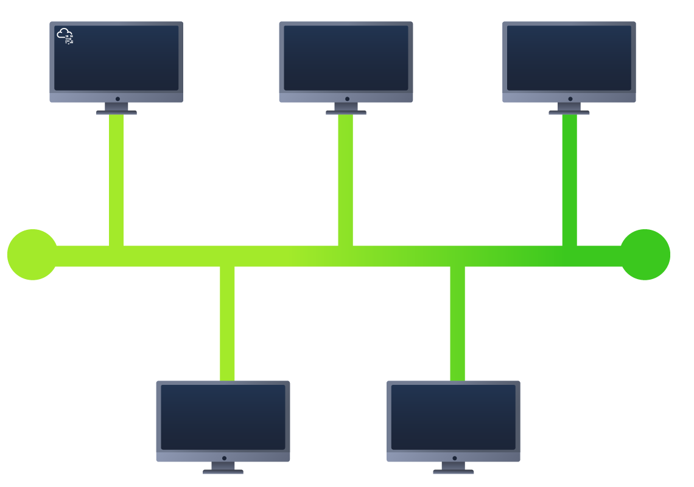
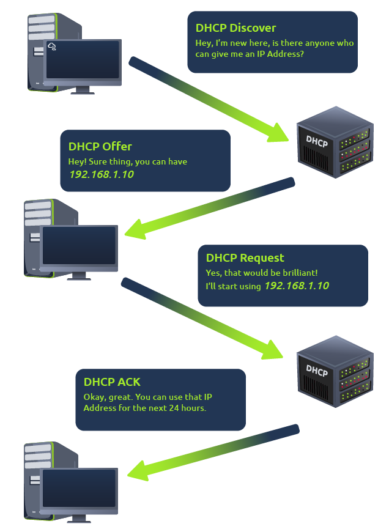

# Introducción a LAN



## <mark style="color:orange;">Presentación de topologías LAN</mark>

#### <mark style="color:yellow;">Topologías de red de área local (LAN)</mark>

A lo largo de los años, ha habido experimentación e implementación de varios diseños de redes. En referencia a las redes, cuando nos referimos al término "topología", en realidad nos estamos refiriendo al diseño o aspecto de la red en cuestión. Analicemos las ventajas y desventajas de estas topologías a continuación.

<figure><figcaption></figcaption></figure>

#### <mark style="color:yellow;">Topología en estrella</mark>

La premisa principal de una topología en estrella es que los dispositivos están conectados individualmente a través de un dispositivo de red central, como como conmutador o concentrador. Esta topología es la más común hoy en día debido a su confiabilidad y escalabilidad: a pesar del costo.

Cualquier información enviada a un dispositivo en esta topología se envía a través del dispositivo central al que se conecta. Vamos a explorar A continuación, se presentan algunas de las ventajas y desventajas de esta topología:

Debido a que se requiere más cableado y la compra de equipos de red dedicados para esta topología, es más más caro que cualquiera de las otras topologías. Sin embargo, a pesar del costo adicional, esto proporciona algunos Ventajas. Por ejemplo, esta topología es mucho más escalable por naturaleza, lo que significa que es muy fácil agregar más dispositivos a medida que aumenta la demanda de la red.

Desafortunadamente, cuanto más escala la red, más mantenimiento se requiere para mantener la red funcional. Éste Una mayor dependencia del mantenimiento también puede dificultar mucho la resolución de fallos. Además, la topología en estrella sigue siendo propenso al fracaso, aunque reducido. Por ejemplo, si falla el hardware centralizado que conecta los dispositivos, Estos dispositivos ya no podrán enviar ni recibir datos. Afortunadamente, estos dispositivos de hardware centralizados son a menudo robusto.

#### <mark style="color:yellow;">Topología de bus</mark>

Este tipo de conexión se basa en una sola conexión que se conoce como red troncal cable. Este tipo de topología es similar a la hoja de un árbol en el sentido de que los dispositivos (hojas) provienen de donde están las ramas en este cable.

Debido a que todos los datos destinados a cada dispositivo viajan a lo largo del mismo cable, es muy rápidamente propenso a volverse lento y Cuello de botella si los dispositivos dentro de la topología solicitan datos simultáneamente. Este cuello de botella también da lugar a difícil solución de problemas porque rápidamente se vuelve difícil identificar qué dispositivo está experimentando problemas con datos todos viajando por la misma ruta.

Sin embargo, dicho esto, las topologías de bus son una de las topologías más fáciles y rentables de configurar debido a sus gastos, como el cableado o el equipo de red dedicado utilizado para conectar estos dispositivos.

Por último, otra desventaja de la topología de bus es que hay poca redundancia en caso de fallos. Esta desventaja se debe a que hay un solo punto de falla a lo largo del cable de la red troncal. Si este cable llegara a break, los dispositivos ya no pueden recibir o transmitir datos a lo largo del bus.

<figure><figcaption></figcaption></figure>

#### <mark style="color:yellow;">Topología de anillo</mark>

La topología de anillo (también conocida como topología de tokens) presenta algunas similitudes. Los dispositivos, como las computadoras, están conectados directamente entre sí para formar un bucle, lo que significa que se requiere poco cableado y menos dependencia de hardware dedicado, como dentro de una topología en estrella.

Una topología de anillo funciona enviando datos a través del bucle hasta que llegan al dispositivo de destino, utilizando otros dispositivos a lo largo de el bucle para reenviar los datos. Curiosamente, un dispositivo solo enviará los datos recibidos de otro dispositivo en este topology si no tiene ninguno para enviarse a sí mismo. Si el dispositivo tiene datos para enviar, enviará los suyos propios datos primero antes de enviar datos desde otro dispositivo.

Dado que solo hay una dirección para que los datos viajen a través de esta topología, es bastante fácil solucionar cualquier problema las faltas que surjan. Sin embargo, esto es un arma de doble filo porque no es una forma eficiente de que los datos viajen una red, ya que es posible que tenga que visitar muchos dispositivos múltiples primero antes de llegar al dispositivo previsto.

Por último, las topologías de anillo son menos propensas a cuellos de botella, como dentro de una topología de bus, ya que se utilizan grandes cantidades de tráfico. no viajar a través de la red en ningún momento. El diseño de esta topología, sin embargo, significa que un fallo como ya que el cable cortado o el dispositivo roto resultarán en la rotura de toda la red.

<figure><figcaption></figcaption></figure>

### <mark style="color:yellow;">¿Qué es un interruptor?</mark>

Los conmutadores son dispositivos dedicados dentro de una red que están diseñados para agregar varios otros dispositivos, como Ordenadores, impresoras o cualquier otro dispositivo con capacidad de red que utilice Ethernet. Estos diversos dispositivos se conectan a un puerto del switch. Los conmutadores generalmente se encuentran en redes más grandes, como empresas, escuelas o redes de tamaño similar, donde hay muchos dispositivos para conectarse a la red. Los conmutadores pueden conectar un gran número de dispositivos al tener puertos de 4, 8, 16, 24, 32 y 64 para que los dispositivos se conecten.

Los interruptores son mucho más eficientes que sus contrapartes menores (concentradores/repetidores). Los interruptores realizan un seguimiento de qué dispositivo está conectado a qué puerto. De esta manera, cuando reciben un paquete, en lugar de repetir ese paquete en cada puerto Al igual que lo haría un concentrador, simplemente lo envía al objetivo previsto, lo que reduce el tráfico de red.

<figure><figcaption></figcaption></figure>

Tanto los conmutadores como los enrutadores se pueden conectar entre sí. La capacidad de hacer esto aumenta la redundancia (el fiabilidad) de una red mediante la adición de múltiples rutas para que los datos tomen. Si un camino baja, se puede usar otro. Si bien esto puede reducir el rendimiento general de una red porque los paquetes tienen que tardar más en viajar, no hay Sin tiempo de inactividad, un pequeño precio a pagar considerando la alternativa.

### <mark style="color:yellow;">¿Qué es un router?</mark>

El trabajo de un router es conectar redes y pasar datos entre ellas. Lo hace mediante el uso de enrutamiento (de ahí el nombre enrutador!).

El enrutamiento es la etiqueta que se le da al proceso de datos que viajan a través de las redes. El enrutamiento implica la creación de una ruta entre redes para que estos datos puedan ser entregada con éxito.

El enrutamiento es útil cuando los dispositivos están conectados por muchas rutas, como en el diagrama de ejemplo a continuación.

<figure><figcaption></figcaption></figure>

### <mark style="color:yellow;">Práctico</mark>

Adjunto a esta tarea se incluye una práctica interactiva con las topologías LAN discutidas. Conozca los diversos formas en las que son vulnerables a romperse. Rompa las topologías de LAN para recuperar la marca.

#### _<mark style="color:purple;">Responda las siguientes preguntas</mark>_

1. ¿Qué significa LAN? **`Local Area Network`**
2. ¿Cuál es el verbo que se le da al trabajo que realizan los enrutadores? **`Routing`**
3. ¿Qué dispositivo se utiliza para conectar de forma centralizada varios dispositivos en la red local y transmitir datos a la ubicación correcta? **`Switch`**
4. ¿Qué topología es rentable configurar? **`Bus Topology`**
5. ¿Qué topología es costosa de configurar y mantener? **`Star Topology`**
6. Complete el laboratorio interactivo adjunto a esta tarea. ¿Cuál es la bandera que se da al final? **`THM{TOPOLOGY_FLAWS}`**

## <mark style="color:orange;">Introducción a las subredes</mark>

Como hemos discutido anteriormente a lo largo del módulo hasta ahora, las redes se pueden encontrar en todas las formas y tamaños, desde pequeñas hasta grandes. La subred es el término que se le da a la división de una red en redes más pequeñas y en miniatura dentro de sí misma. Piensa en ello como cortar un pastel para tus amigos. Solo hay una cierta cantidad de pastel para todos, pero todos quieren un trozo. La subred es usted decidiendo quién se queda con qué rebanada y reservando tal rebanada de este pastel metafórico.

Tomemos un negocio, por ejemplo; Contarás con diferentes departamentos como:

* Contabilidad
* Finanzas
* Recursos humanos

<figure><figcaption></figcaption></figure>

Si bien sabes dónde enviar información en la vida real al departamento correcto, las redes también deben saberlo. Los administradores de red utilizan las subredes para categorizar y asignar partes específicas de una red para reflejar esto.

La creación de subredes se logra dividiendo el número de hosts que pueden caber dentro de la red, representados por un número llamado máscara de subred. Volvamos a nuestro diagrama de la primera sala de este módulo:

<figure><figcaption></figcaption></figure>

Como podemos recordar, una dirección IP se compone de cuatro secciones llamadas octetos. Lo mismo ocurre con una máscara de subred, que también se representa como un número de cuatro bytes (32 bits), que va de 0 a 255 (0-255).

Las subredes usan direcciones IP de tres maneras diferentes:

* Identificar la dirección de red
* Identificar la dirección de host
* Identificación de la puerta de enlace predeterminada

Dividamos estos tres para comprender sus propósitos en la siguiente tabla:

|                    Tipo                    |                                                                                Propósito                                                                               |                                                                                                                                                 Explicación                                                                                                                                                 |          Ejemplo         |
| :----------------------------------------: | :--------------------------------------------------------------------------------------------------------------------------------------------------------------------: | :---------------------------------------------------------------------------------------------------------------------------------------------------------------------------------------------------------------------------------------------------------------------------------------------------------: | :----------------------: |
|         
Dirección de red 
        |                          
Esta dirección identifica el inicio de la red real y se utiliza para identificar la existencia de una red. 
                         |                                                                                            
Por ejemplo, un dispositivo con la dirección IP 192.168.1.100 estará en la red identificada por 192.168.1.0 
                                                                                           |  
192.168.1.0 
  |
|        
Dirección del host 
       |                                        
Aquí se utiliza una dirección IP para identificar un dispositivo en la subred 
                                        |                                                                                                                
Por ejemplo, un dispositivo tendrá la dirección de red 192.168.1.1 
                                                                                                                | 
192.168.1.100 
 |
| 
Puerta de enlace predeterminada 
 | 
La dirección de puerta de enlace predeterminada es una dirección especial asignada a un dispositivo de la red que es capaz de enviar información a otra red 
 | 
Cualquier dato que deba ir a un dispositivo que no esté en la misma red (es decir, que no esté en 192.168.1.0) se enviará a este dispositivo. Estos dispositivos pueden usar cualquier dirección de host, pero generalmente usan la primera o la última dirección de host en una red (.1 o .254) 
 | 
192.168.1.254 
 |

Ahora, en redes pequeñas, como en casa, estará en una subred, ya que existe una posibilidad poco probable de que necesite más de 254 dispositivos conectados a la vez.

Sin embargo, lugares como empresas y oficinas tendrán muchos más de estos dispositivos (PC, impresoras, cámaras y sensores), donde se lleva a cabo la creación de subredes.

Las subredes proporcionan una serie de ventajas, entre las que se incluyen:

* Eficacia
* Seguridad
* Control total

Más adelante exploraremos exactamente cómo las subredes proporcionan estos beneficios; Sin embargo, por ahora, todo lo que necesitamos entender es el elemento de seguridad. Tomemos el típico café de la calle. Este café contará con dos redes:

1. Uno para los empleados, cajas registradoras y otros dispositivos para la instalación
2. Uno para que el público en general lo use como punto de acceso

Las subredes le permiten separar estos dos casos de uso entre sí y, al mismo tiempo, tener los beneficios de una conexión a redes más grandes, como Internet.

#### _<mark style="color:purple;">Responda las siguientes preguntas</mark>_

1. ¿Cuál es el término técnico para dividir una red en partes más pequeñas? **`Subnetting`**
2. ¿Cuántos bits hay en una máscara de subred? **`32`**
3. ¿Cuál es el rango de una sección (octeto) de una máscara de subred? **`0-255`**
4. ¿Qué dirección se utiliza para identificar el inicio de una red? **`Network Address`**
5. ¿Qué dirección se utiliza para identificar dispositivos dentro de una red? **`Host Address`**
6. ¿Cómo se llama para identificar al dispositivo responsable de enviar datos a otra red? **`Default Gateway`**

## <mark style="color:orange;">ARP</mark>

Recordando de nuestras tareas anteriores que los dispositivos pueden tener dos identificadores: una dirección MAC y una dirección IP, la Address Resolution Protocol o ARP para abreviar, es la tecnología que se encarga de permitir que los dispositivos se identifiquen en una red.

Simplemente, ARP permite que un dispositivo asocie su dirección MAC con una dirección IP en la red. Cada dispositivo de una red mantendrá un registro de las direcciones MAC asociadas con otros dispositivos.

Cuando los dispositivos deseen comunicarse con otros, enviarán una transmisión a toda la red en busca del dispositivo específico. Los dispositivos pueden usar ARP para encontrar la dirección MAC (y, por lo tanto, el identificador físico) de un dispositivo para la comunicación.

#### <mark style="color:yellow;">¿Cómo funciona el ARP?</mark>

Cada dispositivo dentro de una red tiene un libro de contabilidad para almacenar información, que se llama caché. En el contexto de ARP, esta caché almacena los identificadores de otros dispositivos en la red.

Para mapear estos dos identificadores juntos (dirección IP y dirección MAC), ARP envía dos tipos de mensajes:

1. ARP Pedir
2. ARP Respuesta

Cuando se envía una solicitud ARP, se transmite un mensaje en la red a otros dispositivos preguntando: "¿Cuál es la dirección MAC que posee esta dirección IP?" Cuando los otros dispositivos reciban ese mensaje, solo responderán si son propietarios de esa dirección IP y enviarán una respuesta ARP con su dirección MAC. El dispositivo solicitante ahora puede recordar esta asignación y almacenarla en su caché ARP para su uso futuro.\

Este proceso se ilustra en el siguiente diagrama:

<figure><figcaption></figcaption></figure>

#### _<mark style="color:purple;">Responda las siguientes preguntas</mark>_

1. ¿Qué significa ARP? **`Address Resolution Protocol`**
2. ¿Qué categoría de paquete ARP pregunta a un dispositivo si tiene o no una dirección IP específica? **`Request`**
3. ¿Qué dirección se utiliza como identificador físico para un dispositivo en una red? **`MAC Address`**
4. ¿Qué dirección se utiliza como identificador lógico para un dispositivo en una red? **`IP Address`**

## <mark style="color:orange;">DHCP</mark>

Las direcciones IP se pueden asignar manualmente, introduciéndolas físicamente en un dispositivo, o de forma automática y, más comúnmente, mediante el uso de un servidor DHCP (Dynamic Host Configuration Protocol). Cuando un dispositivo se conecta a una red, si aún no se le ha asignado manualmente una dirección IP, envía una solicitud (DHCP Discover) para ver si hay servidores DHCP en la red. A continuación, el servidor DHCP responde con una dirección IP que el dispositivo podría utilizar (oferta DHCP). A continuación, el dispositivo envía una respuesta confirmando que desea la dirección IP ofrecida (solicitud DHCP) y, por último, el servidor DHCP envía una respuesta reconociendo que se ha completado y que el dispositivo puede empezar a utilizar la dirección IP (DHCP ACK).

<figure><figcaption></figcaption></figure>

#### _<mark style="color:purple;">Responda las siguientes preguntas</mark>_

1. ¿Qué tipo de paquete DHCP utiliza un dispositivo para recuperar una dirección IP?  **`DHCP Discover`**
2. ¿Qué tipo de paquete DHCP envía un dispositivo una vez que el servidor DHCP le ha ofrecido una dirección IP? **`DHCP Request`**
3. Por último, ¿cuál es el último paquete DHCP que se envía a un dispositivo desde un servidor DHCP? **`DHCP ACK`**

Continúa tu aprendizaje: Modelo OSI

Continúa tu aprendizaje uniéndote a la [sala "Modelo OSI".](https://tryhackme.com/room/osimodelzi)

#### _<mark style="color:purple;">Responda las siguientes preguntas</mark>_

1. Únete a la [sala "Modelo OSI".](https://tryhackme.com/room/osimodelzi)
