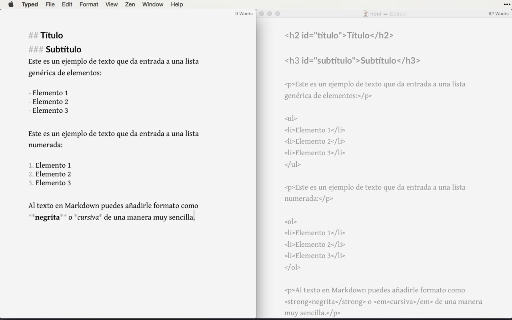

# Markdown

Markdown es un _**lenguaje de marcado**_ con el que puede agregar formato a documentos de texto plano. Fue creado por `John Gruber (2004)`, siendo a día de hoy uno de los lenguajes de marcado más famosos. Su popularidad se debe a que es _sencillo_, _ligero_ y _fácil de aprender_ por parte de aquellas personas que no tienen un perfil técnico.

**Markdown** se considera un lenguaje que tiene la finalidad de permitir crear contenido de _manera sencilla_ de escribir, y que en todo momento mantenga un diseño legible. Este método le permitirá añadir formatos tales como (negritas, cursivas o enlaces), utilizando simplemente _**texto plano**_, lo que hará de su escritura algo más simple y eficiente al evitar distracciones.

Al principio puede que le cueste un tiempo acostumbrarse a escribir con esta sintaxis, especialmente si está acostumbrado a usar editores visuales, pero con el tiempo puede que no desee otras opciones. El hecho de poder almacenar texto con su formato en documentos de texto plano y de poder visualizarlo con cualquier aplicación es una gran ventaja.

A continuación puede apreciar un ejemplo de cómo se redacta un texto con Markdown:

<figure><figcaption></figcaption></figure>

Puede agregar elementos en **formato Markdown** a cualquier archivo de texto plano mediante cualquier editor de texto. También existen muchos editores de texto que se centran exclusivamente en el formato Markdown para los sistemas operativos MacOS, Windows, Linux, iOS y Android. La mayoría de editores Markdown también permiten previsualizar el resultado en tiempo real a medida que escribe.

A continuación se muestran algunas de las diferencias entre el lenguaje de programación `HTML` y `Markdown`.

<figure><figcaption></figcaption></figure>

### Importancia <a href="#importancia" id="importancia"></a>

**Markdown** es perfecto sobre todo si se publica de manera constante en _Internet_, donde el lenguaje HTML está más que presente: (WordPress, Squarespace, Jekyll, entre otros.). Además, una de las grandes ventajas de este lenguaje de programación es que está cada vez más extendido en el `mundo offline`. Nada le impedirá utilizar este lenguaje para _tomar notas_ y apuntes de sus clases o reuniones mediante una determinada aplicación.

Gracias a la **simplicidad** de su sintaxis podrá utilizarlo siempre que necesite escribir y dar formato rápidamente, sobre todo si quiere hacerlo desde algún dispositivo móvil. Este tipo de formato siempre será compatible con todas las plataformas existentes, así que utilizar Markdown es una manera de mantener todo el contenido siempre accesible desde cualquier dispositivo (smartphones, ordenadores de escritorio, tablets, entre otros), ya que en cualquiera de los dispositivos mencionados anteriormente siempre encontrará aplicaciones adecuadas para leer y editar este tipo de contenido.

A continuación se anexa una lista con los diferentes motivos por los que debería aprender a usar la sintaxis de Markdown:

Markdown es un formato muy versátil que permite crear documentos, notas, libros, documentaciones, emails e incluso los textos de cualquier web.

* Markdown es un formato muy establecido que cada vez tiene más soporte por parte de la comunidad. Podrá usar el formato Markdown en montones de gestores de contenidos, foros y aplicaciones sociales. Por ejemplo, Markdown es el formato que se usa por defecto en GitHub y en casi cualquier herramienta relacionada con el mundo de la programación. Del mismo modo, también podrá crear posts mediante Markdown en foros como ForoStack o en aplicaciones sociales como Reddit.
* Markdown no depende de la plataforma en la que se ejecute, ya que podrá crear documentos Markdown en cualquier sistema operativo. De hecho, puedes abrir la aplicación de notas del teléfono que tenías hace 10 años y comenzar a crear un documento Markdown. Podrás crear documentos Markdown en Windows, Linux, macOS, Android, iOS, freeBSD e incluso en MS-DOS.
* Markdown es portable, ya que los archivos Markdown pueden ser abiertos en cualquier editor de texto. Si se ha creado un documento con un editor pero luego cambia de idea y prefiere usar otro, podrá abrir el documento en el nuevo editor sin realizar conversiones de ningún tipo.
* El formato Markdown perdurará en el tiempo aunque la aplicación que uses deje de estar soportada y ya no funcione. El hecho de saber que cualquier persona podrá abrir un documento Markdown dentro de 30 años es uno de los motivos por los que una gran cantidad de textos académicos se crean en formato Markdown. Si creas un libro y pretendes mejorarlo en el futuro, este formato te permirá editarlo en cualquier momento y en cualquier lugar.

A continuación vamos a ver cómo funciona Markdown y cómo se procesan los documentos que usan esta sintaxis.

## Sintaxis <a href="#sintaxis" id="sintaxis"></a>

A continuación se describirá la **sintaxis Markdown** y los _conceptos básicos_ para escribir utilizando este lenguaje de marcado. De hecho, al final del mismo estará perfectamente capacitado para empezar a utilizar este lenguaje en sus escritos y publicaciones. La mejor manera de hacerse una idea de la sintaxis de Markdown es simplemente echar un vistazo a un escrito formateado como tal.

## 1. Elementos de bloque <a href="#id-1-elementos-de-bloque" id="id-1-elementos-de-bloque"></a>

### 1.1 Párrafos y saltos de línea <a href="#id-11-parrafos-y-saltos-de-linea" id="id-11-parrafos-y-saltos-de-linea"></a>

Para generar un nuevo párrafo en Markdown simplemente separa el texto mediante una línea en blanco (pulsando dos veces _intro_). Al igual que sucede con HTML, _**Markdown no soporta dobles líneas en blanco**_, así que si intenta generarlas estas se convertirán en una sola al procesarse.

Para realizar un salto de línea y empezar una frase en una línea siguiente dentro del mismo párrafo, tendrá que **pulsar dos veces la barra espaciadora** antes de pulsar una vez intro. Por ejemplo si desea escribir un poema Haiku quedaría de la siguiente manera:

```
«Andando con sus patitas mojadas,
el gorrión
por la terraza de madera»
```

Donde cada verso tiene dos espacios en blanco al final.

### 1.2 Encabezados <a href="#id-12-encabezados" id="id-12-encabezados"></a>

Las `# almohadillas` son uno de los métodos utilizados en Markdown para **crear encabezados**. Se debe usarlos añadiendo uno por cada nivel. También se pueden cerrar los encabezados con el mismo número de almohadillas, por ejemplo, escribiendo `### Encabezado 3 ###`. Pero la única finalidad de esto es un motivo estético.

Es decir,

```
# Título
## Subtítulo 1
### Subtítulo 2
#### Subtítulo 3
##### Subtítulo 4
###### Subtítulo 5
```

Existe otra manera de generar encabezados, aunque este método está limitado a dos niveles. Consiste en subrayar los encabezados con el símbolo `= (para el encabezado 1)`, o `con guiones - (para el encabezado 2)`.

Es decir,

```
Esto sería un encabezado 1
===

Esto sería un encabezado 2
—--
```

No existe un número concreto de `=` o `-` que necesite escribir para que esto funcione, ¡incluso bastaría con uno!

### 1.3 Citas <a href="#id-13-citas" id="id-13-citas"></a>

Las citas se generan utilizando el carácter `mayor que >` al comienzo del bloque de texto.

> Un país, una civilización se puede juzgar por la forma en que trata a sus animales. — Mahatma Gandhi

```
> Un país, una civilización se puede juzgar por la forma en que trata a sus animales.  — Mahatma Gandhi
```

Si la cita en cuestión se compone de varios párrafos, deberás añadir el mismo `símbolo >` al comienzo de cada uno de ellos.

> Creo que los animales ven en el hombre un ser igual a ellos que ha perdido de forma extraordinariamente peligrosa el sano intelecto animal. Es decir, que ven en él al animal irracional, al animal que ríe, al animal que llora, al animal infeliz. — Friedrich Nietzsche

```
> Creo que los animales ven en el hombre un ser igual a ellos que ha perdido de forma extraordinariamente 
  peligrosa el sano intelecto animal.
> Es decir, que ven en él al animal irracional, al animal que ríe, al animal que llora, al animal 
  infeliz. — Friedrich Nietzsche
```

Incluso puedes `concatenar varios >>` para crear citas anidadas.

```
> Esto sería una cita como la que acabas de ver.
> 
>> Dentro de ella puedes anidar otra cita.
> 
> La cita principal llegaría hasta aquí. 
Esto sería una cita como la que acabas de ver.

Dentro de ella puedes anidar otra cita.

La cita principal llegaría hasta aquí.
```

Recuerda **separar los saltos de línea** con `>,` o `>>` si se encuentra dentro de la cita anidada; para crear párrafos dentro del mismo bloque de cita.

### 1.5 Listas <a href="#id-15-listas" id="id-15-listas"></a>

A diferencia de lo que ocurre en HTML, generar listas en Markdown es tremendamente sencillo. Puedes encontrarte con dos tipos.

#### Listas desordenadas <a href="#listas-desordenadas" id="listas-desordenadas"></a>

Para crear listas desordenadas utiliza \* asteriscos, - guiones, o + símbolo de suma.

```
- Elemento de lista 1
- Elemento de lista 2
* Elemento de lista 3
* Elemento de lista 4
+ Elemento de lista 5
+ Elemento de lista 6
```

Da igual qué elemento escojas, incluso puedes intercambiarlos. Todos se verán igual al procesarse.

* Elemento de lista 1
* Elemento de lista 2
* Elemento de lista 3
* Elemento de lista 4
* Elemento de lista 5
* Elemento de lista 6

Para generar listas anidadas dentro de otras, simplemente tendrás que añadir _4 espacios en blanco antes del siguiente signo_ `-` o `+`.

* Elemento de lista 1
* Elemento de lista 2
  * Elemento de lista 3
  * Elemento de lista 4
    * Elemento de lista 5
    * Elemento de lista 6

#### Listas ordenadas <a href="#listas-ordenadas" id="listas-ordenadas"></a>

Para crear listas ordenadas debes utilizar la sintaxis de tipo: «número.» 1.. Al igual que ocurre con las listas desordenadas, también podrás anidarlas o combinarlas.

```
1. Elemento de lista 1
2.  Elemento de lista 2
    - Elemento de lista 3
    - Elemento de lista 4
        1. Elemento de lista 5
        2. Elemento de lista 6
```

Como se aprecia anteriormente, `Markdown` cumple perfectamente los objetivos por lo que fue diseñado, y con ello es posible hacer publicaciones lo más legibles posible.

Otro de los objetivos de Markdown, es el poder publicar los documentos _“tal cual como están”_. No importa si el resultado final que se necesita es _HTML_, _PDF_ o _texto en formato enriquecido (RTF)_; ya que siempre se podrá obtener estos formatos a través de un conversor, o a través de aplicaciones compatibles con Markdown.

### 1.6 Códigos de bloque <a href="#id-16-codigos-de-bloque" id="id-16-codigos-de-bloque"></a>

Si quieres crear un bloque entero que contenga código. Lo único que tienes que hacer es encerrar dicho párrafo entre dos líneas formadas por tres \~ virgulillas.

Tal que así:

```
~~~
Creando códigos de bloque.
Puedes añadir tantas líneas y párrafos como quieras.  
~~~
```

De esta forma, obtendrás el siguiente resultado:

\~\~ Creando códigos de bloque. Puedes añadir tantas líneas y párrafos como quieras. \~\~

### 1.7 Reglas horizontales <a href="#id-17-reglas-horizontales" id="id-17-reglas-horizontales"></a>

Las reglas horizontales se utilizan para separar secciones de una manera visual. Las estás viendo constantemente en este artículo ya que las estoy utilizando para separar los diferentes elementos de sintaxis de Markdown. Para crearlas, en una línea en blanco deberás incluir tres de los siguientes elementos: _asteriscos_, _guiones_ o _guiones bajos_.

Es decir:

```
***

---

___
```

También puedes separarlos mediante un espacio en blanco por pura estética.

```
* * *
- - -
_ _ _
```

## 2. Elementos de línea <a href="#id-2-elementos-de-linea" id="id-2-elementos-de-linea"></a>

### 2.1 Énfasis (negritas y cursivas) <a href="#id-21-enfasis-negritas-y-cursivas" id="id-21-enfasis-negritas-y-cursivas"></a>

Markdown utiliza _asteriscos_ o _guiones bajos_ para enfatizar; simplemente tendrá que envolver palabras o textos en éstos símbolos para conseguir cursivas o negritas.

| Markdown    | Resultado |
| ----------- | --------- |
| _cursiva_   | cursiva   |
| _cursiva_   | cursiva   |
| **negrita** | negrita   |
| **negrita** | negrita   |

Por supuesto si quiere utilizar los dos tipos de énfasis no tiene más que combinar la sintaxis, envolviendo la palabra entre **3 asteriscos** o **3 guiones bajos**.

| Markdown                | Resultado         |
| ----------------------- | ----------------- |
| _**cursiva y negrita**_ | cursiva y negrita |
| _**cursiva y negrita**_ | cursiva y negrita |

### 2.2 Links o enlaces <a href="#id-22-links-o-enlaces" id="id-22-links-o-enlaces"></a>

Añadir enlaces a una publicación, más que común, hoy en día es algo casi obligatorio. Con Markdown tendrá varias formas de hacerlo.

#### Links o enlaces en línea <a href="#links-o-enlaces-en-linea" id="links-o-enlaces-en-linea"></a>

Son los enlaces de toda la vida. Como su nombre indica, se encuentran en línea con el texto. Se crean escribiendo la palabra o texto enlazada entre `[] corchetes`, y el link entre `() paréntesis`.

| Markdown                                 | Resultado       |
| ---------------------------------------- | --------------- |
| [enlace en línea](http://www.limni.net/) | enlace en línea |

#### Links o enlaces como referencia <a href="#links-o-enlaces-como-referencia" id="links-o-enlaces-como-referencia"></a>

La desventaja del método anterior, es que si utiliza links demasiado complejos o largos pueden dificultarte la lectura de tu texto; para solucionarlo y crear contenido de una manera más ordenada puede generar enlaces de referencia. Esto quiere decir que en el texto enlazará palabras o códigos concretos (formados por letras y/o números), que en otro lugar más apartado del documento tendrá definidos como determinadas URL.

```
[nombre que quieres darle a tu enlace][nombre de tu referencia]

[nombre de tu referencia]: http:www.tuenlace.com
```

### 2.3 Código <a href="#id-23-codigo" id="id-23-codigo"></a>

En según que tipo de publicaciones (sobre todo las de carácter técnico), se necesitará añadir pequeñas secciones donde mostrar código de otro lenguaje, atajos de teclado, o demás contenido que no debería ser tratado como tal. Para ello se tiene disponible 2 alternativas.

#### Código puro < code> <a href="#codigo-puro-code" id="codigo-puro-code"></a>

La forma más sencilla de escribir código en Markdown es envolver el texto entre `dos comillas sencillas`. Esto se corresponde con la etiqueta HTML < code>

`Esto es una línea de código` Se verá como Esto es una línea de código.

Como ves, es muy útil para introducir código dentro de la misma línea o párrafo, algo que no permite el método siguiente.

#### Texto preformateado \<pre> <a href="#texto-preformateado-pre" id="texto-preformateado-pre"></a>

La otra manera de añadir código en Markdown es comenzar el párrafo con cuatro espacios en blanco. Esto se corresponde con la etiqueta HTML \<pre>

Ojo, ¡estos espacios deberás incluirlos en cada línea que escribas! Para añadir código en bloque es mejor utilizar la sintaxis que viste anteriormente: códigos de bloque.

### 2.4 Imágenes <a href="#id-24-imagenes" id="id-24-imagenes"></a>

Insertar una imagen con Markdown se realiza de una manera prácticamente idéntica a insertar links. Solo que en este caso, deberás añadir un símbolo de ! exclamación al principio y el enlace no será otro que la ubicación de la imagen. El texto alternativo es lo que se mostraría si la carga de la imagen fallase. También podrás añadir un título alternativo entrecomillándolo al final de la ruta. Esto sería el título mostrado al dejar el cursor del ratón sobre la imagen.

Ya que al añadir imágenes también estás tratando con URLs, puedes utilizar el método que viste anteriormente para incluir links mediante referencias, solo que en este caso los enlaces de referencia serán aquellos donde se encuentre tu imagen.

De esta forma podrías insertar una imagen 

O dos, sin ensuciar tu espacio de escritura. 

### 2.5 Elementos varios <a href="#id-25-elementos-varios" id="id-25-elementos-varios"></a>

Links automáticos Estos son necesarios cuando lo que quieres es mostrar una URL completa, y no un enlace enmascarado bajo una palabra o frase como ocurre con los links en línea. Para generar links automáticos tan solo tendrás que rodearlos con los símbolos < >

[http://www.limni.net](http://www.limni.net/)

### Referencias <a href="#referencias" id="referencias"></a>

* [Guía en Español](https://markdown.es/)
* [Github docs](https://docs.github.com/es/get-started/writing-on-github/getting-started-with-writing-and-formatting-on-github/basic-writing-and-formatting-syntax)
* [Tutorial Markdown](https://tutorialmarkdown.com/)
* [Mundi Mark](https://github.com/mundimark)
* [Markdownguide](https://www.markdownguide.org/) https://mugan86.medium.com/gu%C3%ADa-b%C3%A1sica-markdown-478a96ddeeaf https://programminghistorian.org/es/lecciones/introduccion-a-markdown https://desarrolloweb.com/
